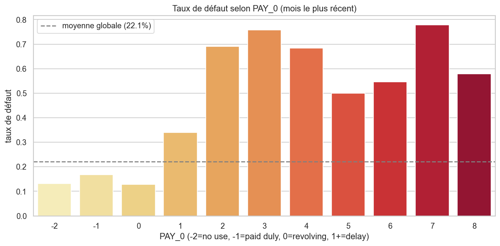
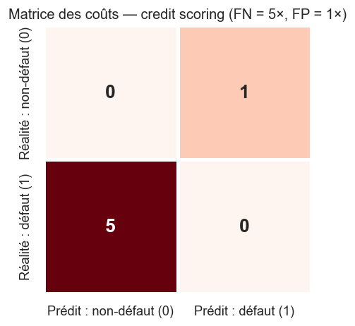
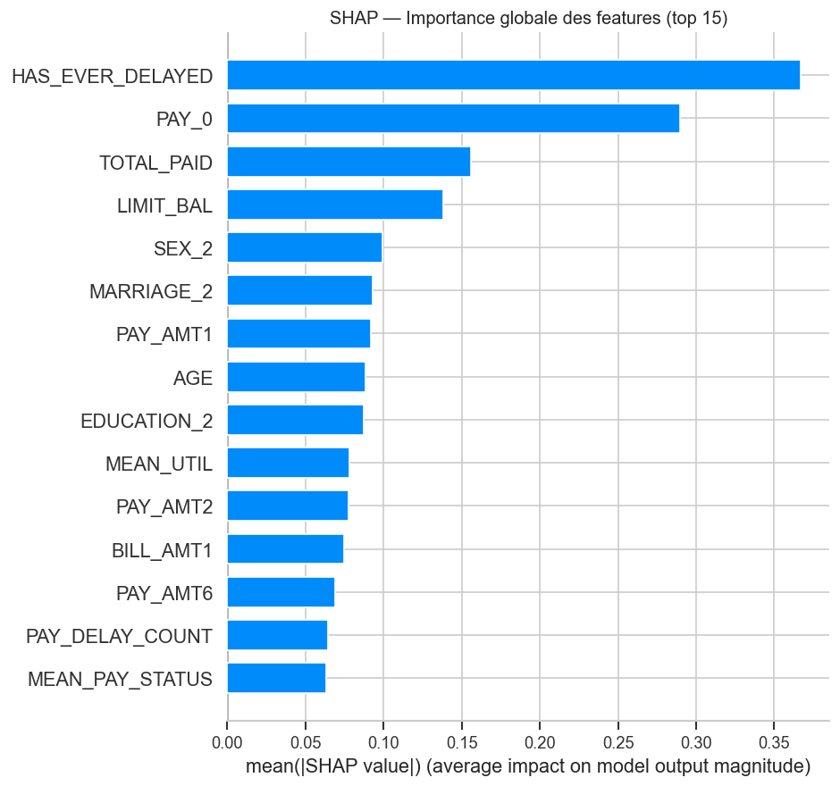
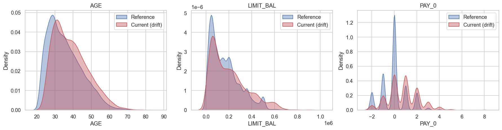

<!--
Slides Marp pour la soutenance.
Pour rendre en PDF : `marp docs/SOUTENANCE.md -o docs/soutenance.pdf`
Pour rendre en HTML : `marp docs/SOUTENANCE.md -o docs/soutenance.html`
-->
---
marp: true
theme: default
paginate: true
size: 16:9
header: 'Credit Scoring MLOps · Examen Master 2'
---

# Credit Scoring — MLOps end-to-end

**Cycle complet : EDA → modèle → API → déploiement → drift**

UCI Credit Card Default (Taiwan, 2005), 30 000 clients.

Stack : MLflow, FastAPI, Docker, GitHub Actions, Render, Streamlit, Evidently.

---

## 1 · Contexte & dataset

- 30 000 clients × 25 colonnes
- Cible : défaut de paiement le mois suivant (22 % positifs)
- Variables : démographie, **6 mois d'historique** de paiements, factures et règlements
- Choisi pour son intitulé "scoring" en banque + ratio FN/FP bien documenté

---

## 2 · Stack technique

| Composant | Choix | Pourquoi |
|-----------|-------|----------|
| Tracking | MLflow + PostgreSQL | Backend persistant exigé par l'énoncé |
| Modèles | LogReg, RandomForest, **XGBoost** | Comparaison linéaire vs tree |
| Déséquilibre | SMOTE in pipeline | Évite data leakage CV |
| Score métier | **business_gain** (FN=5×FP) | Bâle II/III |
| API | FastAPI + Pydantic | Validation auto, docs auto |
| UI | Streamlit + Plotly gauge | Démo interactive |
| Drift | Evidently AI | Standard market |
| CI/CD | GitHub Actions + Render | Auto-deploy sur push |

---

## 3 · EDA — findings clés



→ `PAY_0` est ultra-prédictif : taux de défaut grimpe de **13 % à 75 %**.

---

## 4 · Feature engineering — 12 features dérivées

4 thèmes business :

- **Comportement** : `PAY_DELAY_COUNT`, `MAX_DELAY`, `MEAN_PAY_STATUS`, `HAS_EVER_DELAYED`
- **Utilisation** : `UTIL_RATIO_1`, `MEAN_UTIL`, `MAX_UTIL`
- **Capacité** : `TOTAL_PAID`, `TOTAL_BILLED`, `PAY_TO_BILL_RATIO`
- **Tendances** : `BILL_TREND`, `PAY_TREND`

→ **4 features dérivées dans le top 5 de corrélation** avec la cible.

---

## 5 · Score métier — pourquoi un score custom



- FN = on accorde le crédit à un futur défaut → perte capital
- FP = on refuse un bon client → manque à gagner
- Ratio **5:1** (standard banking)
- Seuil de décision **optimisé** sur ce coût → ~0.28 (au lieu de 0.5)

---

## 6 · Entraînement — pipeline & comparaison

`imblearn.Pipeline` : `preprocessor → SMOTE → classifier`
`StratifiedKFold(5)` · `scoring=business_gain` · GridSearchCV

| Modèle | CV gain | Test gain | Recall | AUC |
|--------|---------|-----------|--------|-----|
| LogReg | 0.47 | 0.46 | 65 % | 0.74 |
| RandomForest | 0.48 | 0.48 | 72 % | **0.78** |
| **XGBoost** 🏆 | 0.40 | **0.484** | **76 %** | 0.77 |

→ **XGBoost** retenu pour son meilleur `business_gain` et son recall.

---

## 7 · Explicabilité — SHAP



3 features dérivées dans le top 5 — le FE a apporté de la valeur réelle.

---

## 8 · API FastAPI

5 endpoints : `/`, `/health`, `/model/info`, `/predict`, `/predict/batch`

- Validation Pydantic stricte (23 champs typés)
- Pipeline interne : `clean()` → `engineer_features()` → modèle → seuil optimisé
- Health check + lifespan loader
- Docker image 800 MB, user non-root

**Tests** : 31/31 PASSED (unitaires + intégration)

---

## 9 · CI/CD & déploiement

- **GitHub Actions** : lint ruff + pytest + build Docker + smoke test
- **Render Blueprint** (`render.yaml`) : déploiement auto sur push main
- **Trigger** : push, PR, ou manuel
- Image construite et testée avant déploiement

URL prod : `https://credit-scoring-api.onrender.com` *(à confirmer après création)*

---

## 10 · Streamlit UI


Formulaire profil client → appel `POST /predict` → gauge interactive + décision colorée.

---

## 11 · Data drift — Evidently AI



Simulation d'une dérive : vieillissement +3 ans, plafond +20 %, retards plus fréquents.
Evidently détecte précisément ces 3 features.

---

## 12 · Stratégie de réentraînement

| Trigger | Action |
|---------|--------|
| `dataset_drift = True` | Réentraînement immédiat |
| Drift sur `PAY_0` | Alerte urgente |
| `business_gain` baisse > 10 % | Réentraînement |
| `AUC` baisse > 0.05 | Investigation |

Pipeline GitHub Action déclenchable à chaque trigger.

---

## 13 · Récap MLOps end-to-end

```
Données brutes (CSV)
   ↓
EDA + clean + FE       — notebook 01_eda
   ↓
Score métier custom    — notebook 02_business_score + tests
   ↓
GridSearch 3 modèles   — notebook 03_training + MLflow
   ↓
best_model.joblib      — XGBoost, seuil 0.28
   ↓
FastAPI Docker         — tests intégration
   ↓
GitHub → Render        — CI/CD auto-deploy
   ↓
Streamlit UI           — démo client final
   ↓
Evidently drift        — monitoring continu
```

---

## 14 · Perspectives

- **Model registry MLflow** : stages dev/staging/prod
- **Monitoring temps réel** : Prometheus + Grafana sur l'API
- **Prédictions tracées** : logger chaque prédiction en base pour analyse drift réel
- **A/B testing** : challenger model vs champion en shadow mode
- **Feature store** : centraliser les features dérivées

---

## Merci 🎉

**Repo** : https://github.com/oumar390/examen-mlops

**MLflow UI** : http://localhost:5050

**Swagger** : http://localhost:8000/docs

**Streamlit** : http://localhost:8501
